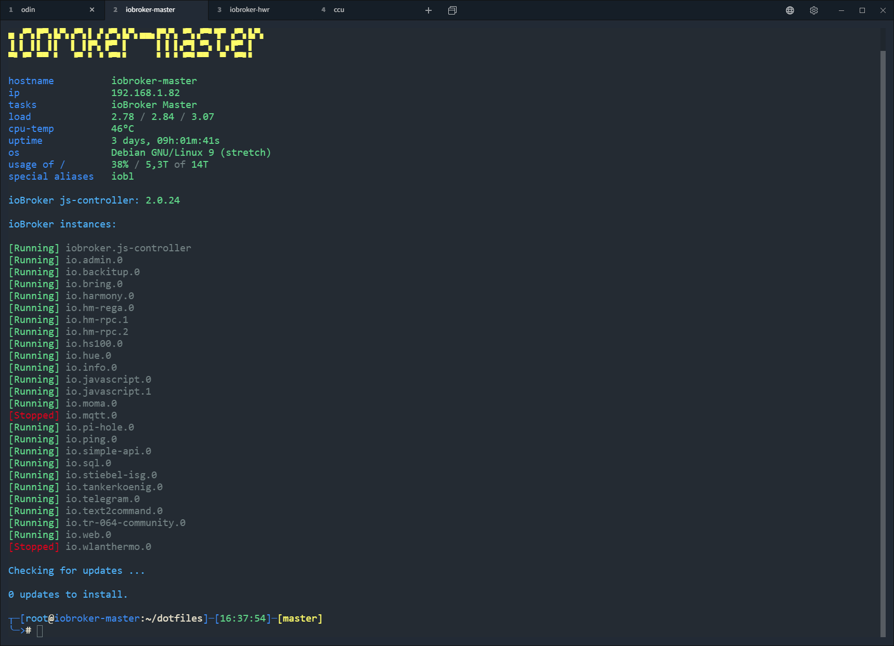

# dotfiles
dotfiles for bash


Screenshot with Terminal https://github.com/Eugeny/terminus

## INSTALL
```
git clone https://github.com/darkiop/dotfiles $HOME/dotfiles
bash ~/dotfiles/install-applications.sh
bash ~/dotfiles/install-bashrc.sh
source ~/.bashrc
```

## LINKS (uses and not used in my dotfiles)
- http://lnav.org/blog
- https://github.com/denisidoro/navi
- https://github.com/Peltoche/lsd (Siehe auch LinuxUser 2020/02 Seite 14)
- https://github.com/Eugeny/terminus
- https://github.com/ryanoasis/nerd-fonts
- https://github.com/ryanoasis/nerd-fonts/tree/master/patched-fonts/Hack#quick-installation
- https://github.com/koljah-de/simple-bash-prompt
- https://github.com/vim-airline/vim-airline
- https://github.com/vim-airline/vim-airline-themes
- https://github.com/ranger/ranger
- https://wiki.ubuntuusers.de/Bash/Prompt/
- https://github.com/brantb/solarized
- https://github.com/Bash-it/bash-it
- https://github.com/tmux
- https://github.com/clvv/fasd
- https://github.com/seebi/dircolors-solarized
- https://www.linux.com/learn/enhancing-virtual-terminals-byobu
- https://github.com/adam-p/markdown-here/wiki/Markdown-Cheatsheet
- https://github.com/LeCoupa/awesome-cheatsheets/blob/master/languages/bash.sh
- https://github.com/chubin/cheat.sh
- https://github.com/denisidoro/navi
- https://github.com/Peltoche/lsd
- https://github.com/aristocratos/bashtop
- https://github.com/sharkdp/bat
- https://drasite.com/blog/Pimp%20my%20terminal#top-from-the-future

## TODO
- https://github.com/chubin/cheat.sh#installation

## key bindungs

### navi

Key | Function
:--- | :---
<kbd>STRG + G</kbd> | navi

### byobu

Key | Function
:--- | :---
<kbd>F2</kbd> | Create a new window
<kbd>F3</kbd> | Move to the previous window
<kbd>F4</kbd> | Move to the next window
<kbd>F5</kbd> | Refresh all status notifications
<kbd>F6</kbd> | Detach from the session and logout
<kbd>Shift</kbd> + <kbd>F6</kbd>| Detach from the session, but do not logout
<kbd>F7</kbd> | Enter scrollback/search mode
<kbd>F8</kbd> | Rename the current window
<kbd>F9</kbd> | Launch the Byobu Configuration Menu
<kbd>F12</kbd> | GNU Screen's Escape Key
<kbd>Alt-Pageup</kbd> | Scroll back through this window's history
<kbd>Alt-Pagedown</kbd> | Scroll forward through this window's history
<kbd>Shift-F2</kbd> | Split the screen horizontally
<kbd>Ctrl-F2</kbd> | Split the screen vertically
<kbd>Shift-F3</kbd> | Move focus to the next split
<kbd>Shift-F4</kbd> | Move focus to the previous split
<kbd>Shift-F5</kbd> | Collapse all splits
<kbd>Ctrl-F5</kbd> | Reconnect any SSH/GPG sockets or agents
<kbd>Shift-F12</kbd> | Toggle all of Byobu's keybindings on or off
