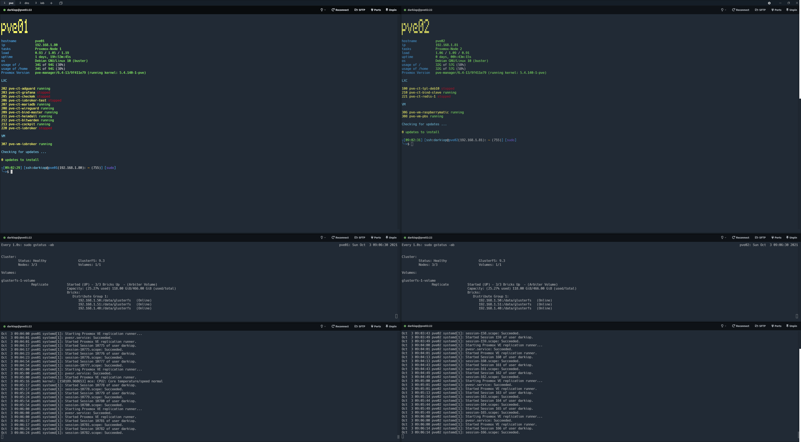

# dotfiles
dotfiles for bash


Screenshot with Terminal https://github.com/Eugeny/terminus

## INSTALL
```
mkdir ~/dotfiles
cd ~/dotfiles
git clone https://github.com/darkiop/dotfiles.git .
./install-applications.sh
./install-bashrc.sh
source ~/.bashrc
```
currently there is no package for lsd (ls deluxe) on debian, it has to be install manually. see https://github.com/Peltoche/lsd

## LINKS
- http://lnav.org/blog
- https://github.com/denisidoro/navi
- https://github.com/Peltoche/lsd (Siehe auch LinuxUser 2020/02 Seite 14)
- https://github.com/Eugeny/terminus
- https://github.com/ryanoasis/nerd-fonts
- https://github.com/ryanoasis/nerd-fonts/tree/master/patched-fonts/Hack#quick-installation
- https://github.com/koljah-de/simple-bash-prompt
- https://github.com/vim-airline/vim-airline
- https://github.com/vim-airline/vim-airline-themes
- https://github.com/ranger/ranger
- https://wiki.ubuntuusers.de/Bash/Prompt/
- https://github.com/brantb/solarized
- https://github.com/Bash-it/bash-it
- https://github.com/tmux
- https://github.com/clvv/fasd
- https://github.com/seebi/dircolors-solarized
- https://www.linux.com/learn/enhancing-virtual-terminals-byobu
- https://github.com/adam-p/markdown-here/wiki/Markdown-Cheatsheet

## byobu

### key bindings

Markdown | Less
--- | ---
<kbd>F2</kbd> | Create a new window
<kbd>F3</kbd> | Move to the previous window
<kbd>F4</kbd> | Move to the next window
<kbd>F5</kbd> | Refresh all status notifications
<kbd>F6</kbd> | Detach from the session and logout
<kbd>Shift</kbd> + <kbd>F6</kbd>| Detach from the session, but do not logout
<kbd>F7</kbd> | Enter scrollback/search mode
<kbd>F8</kbd> | Rename the current window
<kbd>F9</kbd> | Launch the Byobu Configuration Menu

F12
	

GNU Screen's Escape Key

Alt-Pageup
	

Scroll back through this window's history

Alt-Pagedown
	

Scroll forward through this window's history

Shift-F2
	

Split the screen horizontally

Ctrl-F2
	

Split the screen vertically

Shift-F3
	

Move focus to the next split

Shift-F4
	

Move focus to the previous split

Shift-F5
	

Collapse all splits

Ctrl-F5
	

Reconnect any SSH/GPG sockets or agents

Shift-F12
	

Toggle all of Byobu's keybindings on or off 
